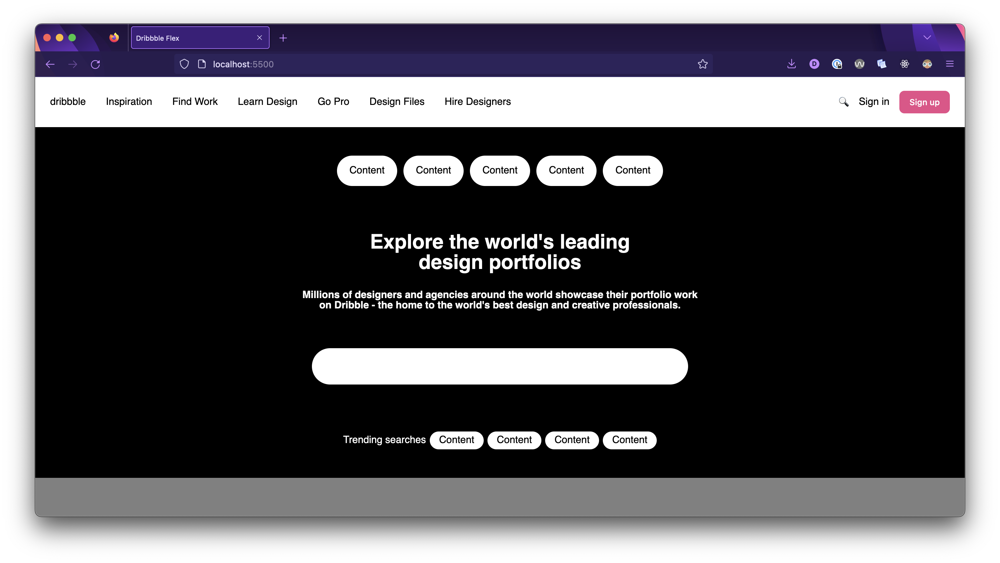

# Build a Landing Page: Hero


**Learning objective:** By the end of this lesson, students will be able to tktk

## Hero Section

On to our Hero section next. Let’s do the same breakdown for this that we did for our nav bar:

> ❓ What’s different about how the Hero section lays out its children compared to the nav?

Note that there is technically another section here - the attribution link at the bottom right - that we’re going to omit.

Here’s some HTML to get us started - copy it into your project.

```html
  <section id="hero">
    <div id="discover">
      <p>Content</p>
      <p>Content</p>
      <p>Content</p>
      <p>Content</p>
      <p>Content</p>
    </div>
    <div id="headers">
      <h1>
        Explore the world's leading
        <br>
        design portfolios
      </h1>
      <h2>
        Millions of designers and agencies around the world showcase their 
        portfolio work
        <br>
        on Dribble - the home to the world's best design and creative
        professionals.
      </h2>
    </div>
    <input type="text">
    <div id="trending">
      Trending searches
      <p>Content</p>
      <p>Content</p>
      <p>Content</p>
      <p>Content</p>
    </div>
  </section>
```

### You Do 💪 - 2 minutes

Take some time to explore this HTML and get more familiar with it. We’ll discuss any points of interest afterwords.

### You Do In Groups 💪 - 25 minutes

Utilize the Complete Guide to Flexbox to help you:

- Give this `hero` `section` a height of 560px, like this section is on dribbble’s site. Also give it a black background and white colored text.
- Turn the `hero` `section` into a Flexbox. Have it lay out its children in a column. Implement a Flexbox property to make it so that each of its children elements has some space around them.
- Turn the `discover` and `trending` `div`s into Flexboxes, have them lay out their children in a row, center those children horizontally and vertically within them, and make it so each element has a small gap between it and the other elements - you can have this match dribbble’s site or not. Give each `p` element a white background with black text (this is different than dribbble’s site, but simpler for us to implement - again the focus here is Flexbox). Also give the `p` elements in both the `discover` and `trending` `div`s an appropriate border radius, along with padding.
- Turn the `headers` `div` into a flexbox and have it lay out its children in a column. Make it so that the font size of the h1 and h2 elements matches the font size from dribbble’s site. Make sure the text is vertically centered as well. Make sure there is no margin at the top of the `h1` element and that there is no margin on the bottom of the `h2` element, or else the `headers` element will be too large.
- Give the input a size matching the size of the input element from dribbble’s site, along with an appropriate amount of padding and border radius. Remove the border from the element as well.

Here’s the resulting CSS that we added!

<details>
  <summary>Solution</summary>

  ```css
  section {
    height: 560px;
    background-color: black;
    display: flex;
    flex-direction: column;
    justify-content: space-around;
    align-items: center;
    color: white;
  }

  h1,
  h2 {
    text-align: center;
  }

  h1 {
    margin-top: 0;
    font-size: 32px;
  }

  h2 {
    font-size: 16px;
    margin-bottom: 0;
  }

  input {
    height: 58px;
    width: 600px;
    border-radius: 29px;
    border: 0px;
    padding: 0 24px;
  }

  #trending,
  #discover {
    display: flex;
    justify-content: center;
    align-items: center;
  }

  #trending {
    gap: 6px;
  }

  #discover {
    gap: 10px;
  }

  #trending > p,
  #discover > p {
    background-color: white;
    color: black;
    border-radius: 50px;
  }

  #discover > p {
    padding: 16px 20px;
  }

  #trending > p {
    padding: 6px 15px;
  }
  ```
</details>

And here’s our re-creation so far:


