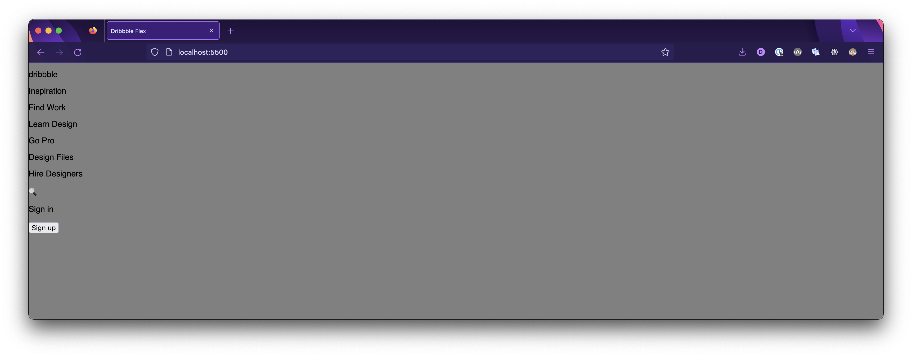
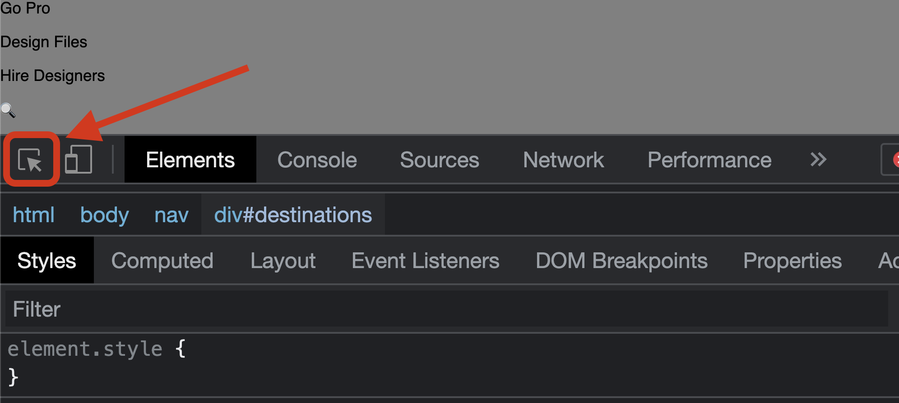

# 

**Learning objective:** By the end of this lesson, students will be able to tktk

## Nav


Above is a dissection of the nav bar for the site. Looking at this we can broadly describe the items on the left side of the nav being ***destinations*** on the site and the items on the right of the nav as being related to user ***actions***.

> 📚 As an aside this is a very, very common pattern across the internet and one that many users will instantly recognize. You can use this knowledge to improve the user experience of your own sites!

So how do we go about coding this? Well, first off there is a natural hierarchy here.

Destinations and actions are both inside of the `nav` and grouped separately so let's start with that:

```html
<nav>
  <div id="destinations">

  </div>
  <div id="actions">

  </div>
</nav>
```

> 🧠 The only reason we're using `id`s on the `div`s above is so that we have an easy reference to them to talk. This is a pattern you'll see repeated throughout this lesson. In a normal project we wouldn't need to use `id`s in this way.

Next, these need some content, so let's fill that in. Remember that what we're going for here is re-creating the general layout - ***not functionality*** - so even though this content is a bunch of links we're just going to create them as `<p>` tags:

```html
<nav>
  <div id="destinations">
    <p>dribbble</p>
    <p>Inspiration</p>
    <p>Find Work</p>
    <p>Learn Design</p>
    <p>Go Pro</p>
    <p>Design Files</p>
    <p>Hire Designers</p>
  </div>
  <div id="actions">
    <p>🔍</p>
    <p>Sign in</p>
    <button>Sign up</button>
  </div>
</nav>
```

Let's check out what we have so far:



Great, our content is in place! Now let's do a small bit of work to get it looking a little bit more like the original, and then we can make it flex!

Go to your browser, open the dev tools, and select the element picker (we lovingly refer to this as the magic wand). Select the `Sign up` button from [our reference site](https://pages.git.generalassemb.ly/modular-curriculum-all-courses/intro-to-flexbox-reference-deployed/). Get used to using this tool often. It's one of the most useful tools you have in the browser to inspect elements quickly.



Let's play with this for a bit and use it to find a few things:

- The color details of the sign up button (the color of the background and the font)
- The font details of the sign up button (specifically, its font weight)
- The details about the border of the sign up button (the border thickness, and radius)
- The dimensions of the sign up button and where those dimensions are coming from (padding)

Here's what we'll need to implement to mimic this styling

```css
nav button {
  background-color: #f082ac;
  border-radius: 8px;
  padding: 10px 16px;
  border: 0;
  color: #ffffff;
  font-weight: 500;
}
```
    

Don't worry, we won't be this detailed about specifics of an element for the rest of this lecture, we're using this as an opportunity to show that these details are available to you in the browser and you can use those details to help implement your own designs.

Even after all this work, we're nowhere close to an exact match, and that's ok - **that's not the goal here!**

### You Do 💪 - 5 minutes

- Find the background color of the nav bar element from [our reference site](https://pages.git.generalassemb.ly/modular-curriculum-all-courses/intro-to-flexbox-reference-deployed/) using the magic wand in the browser and change the color of our nav bar element to match.
- Turn the nav bar into a Flexbox. Select a value on `justify-content` to make the `destinations` and `actions` appear on opposite sides of the nav bar. Use the [Complete Guide to Flexbox](https://css-tricks.com/snippets/css/a-guide-to-flexbox/) to help you accomplish this. This won't look great at the moment, but it's a start.

> 💡 Something you'll notice when implementing Flexbox is that things will commonly look much worse until they start to look better.

Here's the resulting code if you need it afterwords

<details>
  <summary>Solution</summary>

  ```css
  nav {
    background-color: white;
    display: flex;
    justify-content: space-between;
  }
  ```
</details>

### You Do In Groups 💪 - 15 minutes

- Turn the `'destinations'` and `'actions'` `div` elements into Flexboxes that lay out their children in a row. Note that these elements are currently flex children - when you turn them into Flexboxes they will be acting as both flex children - to the `nav` element - ***and*** flex parents - to the elements that are inside of them.
- Using the [Complete Guide to Flexbox](https://css-tricks.com/snippets/css/a-guide-to-flexbox/), research a method we could use to create some space between the different elements inside of these `div`s. You can reference the nav bar element from [our reference site](https://pages.git.generalassemb.ly/modular-curriculum-all-courses/intro-to-flexbox-reference-deployed/) to find the spacing between elements there, or not.
- Find the height of the nav bar element from [our reference site](https://pages.git.generalassemb.ly/modular-curriculum-all-courses/intro-to-flexbox-reference-deployed/) using the magic wand in the browser and make it so that the height of our nav bar matches. Note that there's quite a few ways you could go about this - there is no right and wrong way here, but some ways will make our future work easier or harder.
- Using the [Complete Guide to Flexbox](https://css-tricks.com/snippets/css/a-guide-to-flexbox/), find a method we could use to center the elements inside of the `destinations` and `actions` vertically in the nav bar. Depending on how you set the height of the nav bar this may take multiple new declarations.
- Add some left and right padding to the `nav` element so that the items on the left and right aren't on the edge of the screen. You can reference the nav bar element from [our reference site](https://pages.git.generalassemb.ly/modular-curriculum-all-courses/intro-to-flexbox-reference-deployed/) to find the padding around those elements there, or not.

And here's the resulting CSS so far if you need it afterwords:

<details>
  <summary>Solution</summary>

  ```css
  html {
    box-sizing: border-box;
  }

  /* The Universal Selector */
  *, /* All elements*/
  *::before, /* All ::before pseudo-elements */
  *::after { /* All ::after pseudo-elements */
    /* height & width will now include border & padding by default
      but can be over-ridden as needed */
    box-sizing: inherit;
  }

  body {
    background-color: gray;
    font-family: sans-serif;
    margin: 0;
  }

  nav {
    background-color: white;
    display: flex;
    justify-content: space-between;
    padding: 0 24px;
  }

  nav button {
    background-color: #ea4c89;
    border-radius: 8px;
    padding: 10px 16px;
    border: 0;
    color: #ffffff;
    font-weight: 500;
  }

  nav > div {
    display: flex;
    height: 80px;
    align-items: center;
  }

  nav > div:first-child {
    gap: 32px;
  }

  nav > div:last-child {
    gap: 16px;
  }
  ```
</details>

Our nav bar looks fantastic, great work!!
