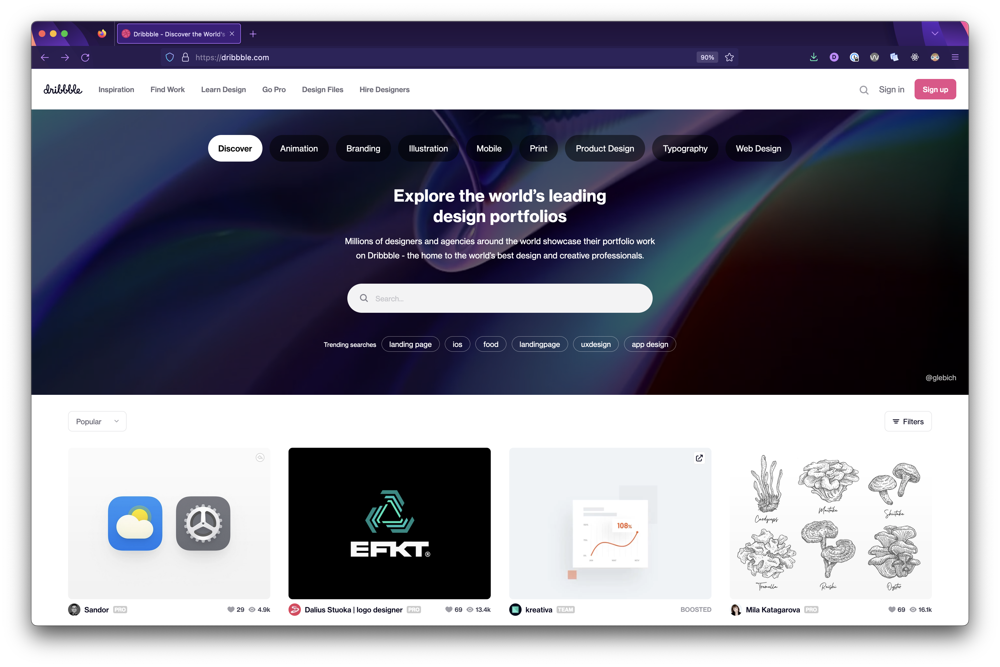

# Build a Landing Page: Setup


**Learning objective:** By the end of this lesson, students will be able to tktk

## Let’s build a site together!

We’re going to re-create an older version of the landing page for [**dribbble.com**](https://pages.git.generalassemb.ly/modular-curriculum-all-courses/intro-to-flexbox-reference-deployed/)!

Just like we'll be focusing on recreating the layout of the reference site and not adding any functionality, the reference site does not have any functionality to worry about either. We've created this static landing page to practice with so that we will have a stable reference for you to focus on, as web applications are continually changing and being updated.

We’ll start by talking about the larger overall pieces of the site and then dive into building those individual pieces to create the whole!

Let’s take a quick look at the site.



## Setup

We’ll need to start from scratch with our HTML and CSS files for this activity. You will have two options, either create a new lecture project to start from scratch or reset the code in your current files you've been using up to this point.

Both options are totally fine.

### Option 1: New Lecture Project

If you want to create a new lecture project from scratch so that you can keep separate notes in it, open the toggle below for a command block you can copy that will do this for you quickly:
<details>
  <summary>New Project Setup</summary>

  Open your Terminal application and navigate to your `~/code/ga/lectures` directory:

  ```bash
  cd ~/code/ga/lectures
  ```

  Make a new directory called `flexbox-site`, then enter this directory:

  ```bash
  mkdir flexbox-site
  cd flexbox-site
  ```

  Create a folder called `css`:

  ```bash
  mkdir css
  ```

  Then, create an `index.html` file and a `style.css` file that lives inside the `css` folder. These files will hold your work for this lecture:

  ```bash
  touch index.html css/style.css
  ```

  With the files created, open the contents of the directory in VS Code:

  ```bash
  code .
  ```

  Open the `index.html` file and add HTML boilerplate by typing `!` and then hitting the `Tab` key.

  Change the `title` to `Dribble Flex`:

  ```html
  <title>Dribble Flex</title>
  ```

  Then make use of the `style.css` file by adding this line inside the `<head>` tag:

  ```html
  <link rel="stylesheet" href="./css/style.css">
  ```

  Add the following to `style.css`:

  ```css
  html {
    box-sizing: border-box;
  }

  /* The Universal Selector */
  *, /* All elements*/
  *::before, /* All ::before pseudo-elements */
  *::after { /* All ::after pseudo-elements */
    /* height & width will now include border & padding by default
      but can be over-ridden as needed */
    box-sizing: inherit;
  }

  body {
    background-color: gray;
    font-family: sans-serif;
    margin: 0;
  }
  ```
</details>

### Option 2: Reset Current Files

If you just want to reset from the beginning with your current files, this toggle has the starter code for you:

<details>
  <summary>Starter Code</summary>

  `index.html`:
  ```html
  <!DOCTYPE html>
  <html lang="en">
  <head>
    <meta charset="UTF-8">
    <meta http-equiv="X-UA-Compatible" content="IE=edge">
    <meta name="viewport" content="width=device-width, initial-scale=1.0">
    <title>Dribbble Flex</title>
    <link rel="stylesheet" href="./css/style.css">
  </head>
  <body>

  </body>
  </html>
  ```

  `css/style.css`:
  ```css
  html {
    box-sizing: border-box;
  }

  /* The Universal Selector */
  *, /* All elements*/
  *::before, /* All ::before pseudo-elements */
  *::after { /* All ::after pseudo-elements */
    /* height & width will now include border & padding by default
      but can be over-ridden as needed */
    box-sizing: inherit;
  }

  body {
    background-color: gray;
    font-family: sans-serif;
    margin: 0;
  }
  ```
</details>

As part of this process, let’s also set some reasonable expectations for what we're trying to accomplish. We’re going to keep our re-creation focused around the layout of the site, not trying to duplicate fonts, photos, colors, animation, functionality, size of elements, etc. This will help keep us focused on the task at hand: **learning to design a site using Flexbox.** The purpose isn't to **FULLY recreate** the site, we're just staying focused on how these elements are laid out at a very basic level.
