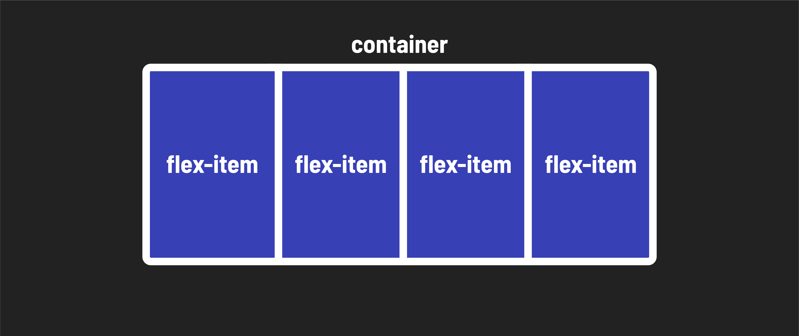

<h1>
  Flexbox
  Concepts
</h1>

**Learning objective:** By the end of this lesson, students will be able to explain the purpose and advantages of using flexbox for precise element layout on web pages.

## What is flexbox?

As you continue your journey as a front-end developer, one of the essential skills you'll need is the ability to precisely lay out elements on web pages. This is where flexbox comes into play.

Prior to flexbox, laying out the parts of a web page - from basic navigation headers to complex full-page layouts - was very difficult. The introduction of flexbox revolutionized the way we approach web design.

At first glance, flexbox might seem like it operates only in a single dimension, essentially in a line. However, as you dive deeper into this lesson, you'll discover that flexbox's capabilities extend beyond that. It allows you to nest flexboxes within one another, enabling you to create complex 2-dimensional layouts that were once quite challenging to achieve.

## Why Use flexbox?

Here are some key advantages of using flexbox over other methods of positioning in CSS:

**Vertically centering content:** Flexbox simplifies the task of vertically centering content and elements within a container, a task that used to require tricky workarounds.

**Uniform spacing:** It provides an elegant solution for evenly spacing child elements within a container, ensuring your designs look polished and consistent.

**Equalizing column heights:** Flexbox can make the heights of child elements, even if they contain varying amounts of content, appear the same. This is a game-changer for creating visually appealing layouts that contain alot of text.

**Responsive design made easy:** Flexbox empowers you to create complex, responsive designs with ease. It replaces less dependable strategies, making your code more maintainable and future-proof.
