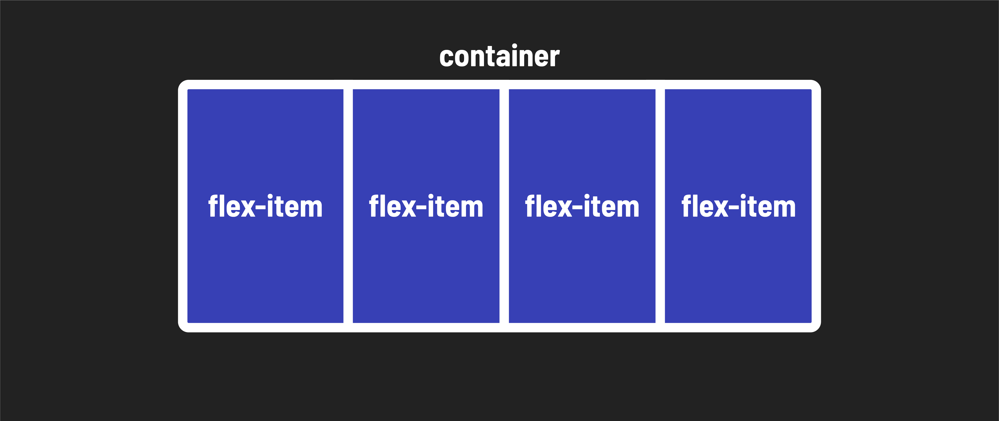

# Concepts

**Learning objective:** By the end of this lesson, students will be able to tktk

# Introduction to Flexbox

As a front-end developer, you will be required to precisely lay out the elements on web pages.

Prior to Flexbox, laying out the parts of a web page - from basic navigation headers to complex full-page layouts - was anything but a straightforward process. Luckily, Flexbox came along and was a game changer, making web design easier, more efficient, and more intuitive.

One thing to note about Flexbox is that it is designed to assist the developer in easily laying out elements one-dimensionally. This makes Flexbox appear quite limited at first glance, but we can nest a flexbox within a flexbox to assist in creating a 2-dimensional layout, as you’ll see in this lesson.

**tktk tktk The image above is taken from the original lecture, but it was downloaded from imgur and not sure about the actual ownership. Also, we can probably create one that better suits our needs.**

# Why Use Flexbox?

Flexbox excels at assisting developers with the following tasks:

- Vertically centering content & elements within a container element.
- Spacing child elements within a container uniformly.
- Making the height of child elements laid out in columns the same even though they have a different amount of content.
- Creating complex, responsive designs without floats, positioning, or other less dependable strategies that can be difficult to maintain.