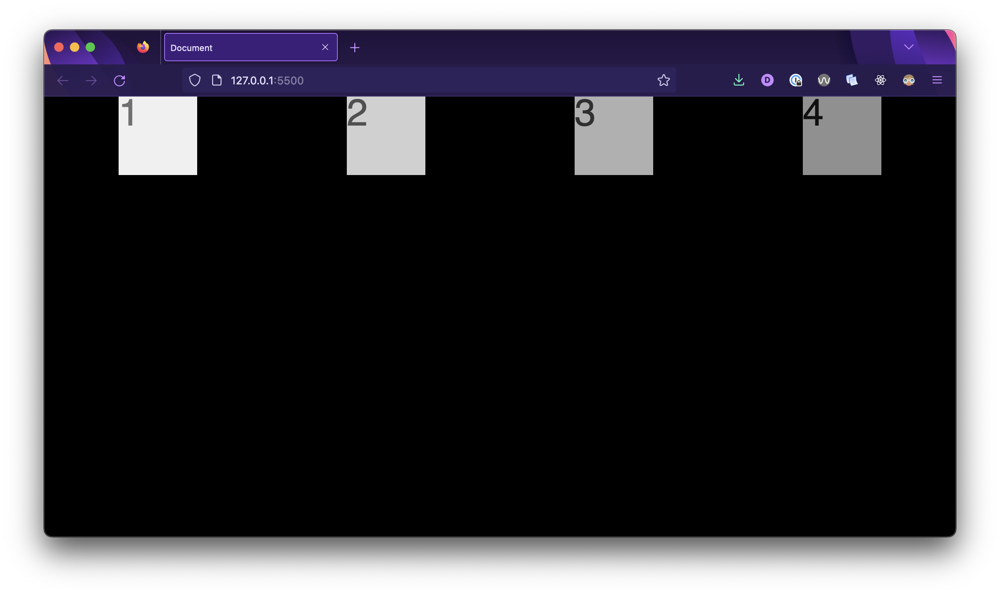
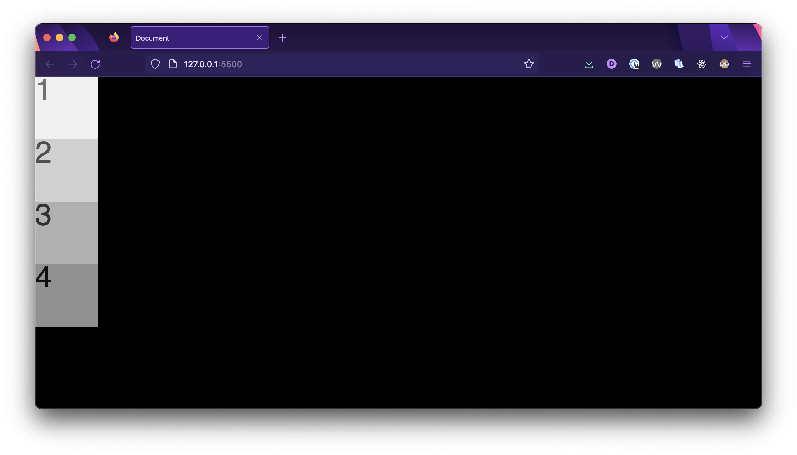
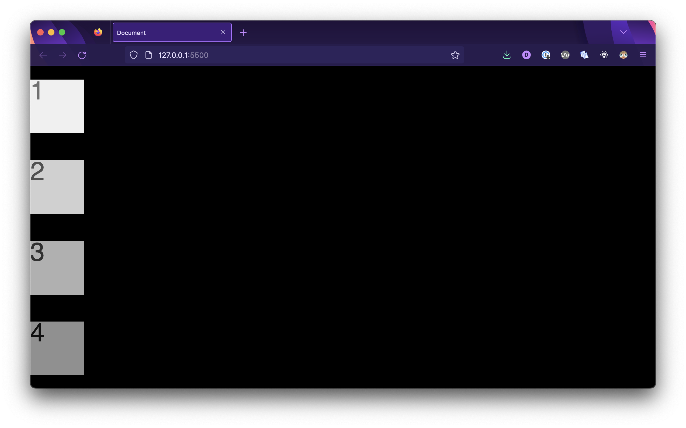
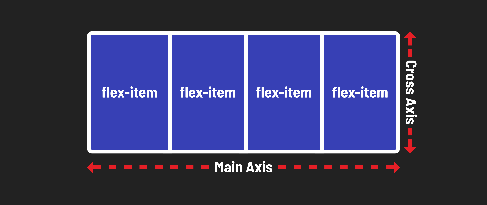
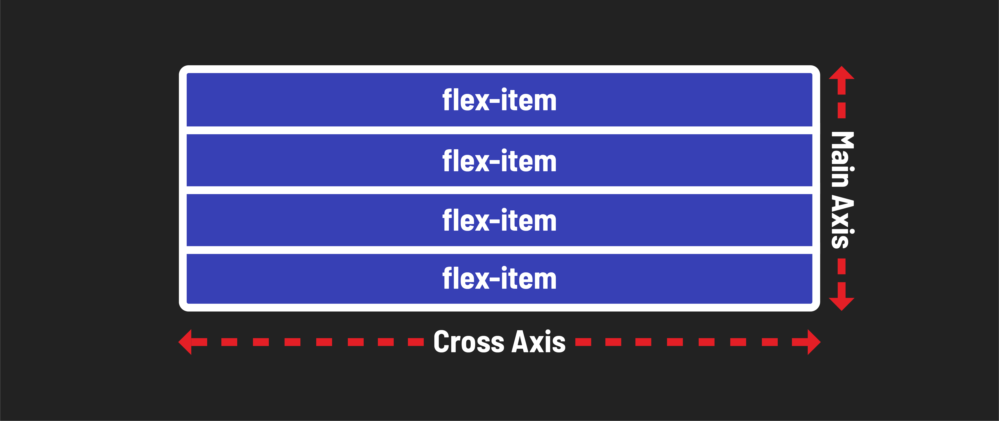

<h1>
  <span class="headline">Flexbox</span>
  <span class="subhead">Flexbox Properties</span>
</h1>

**Learning objective:** By the end of this lesson, students will be able to adjust the spacing of flex child elements and change the direction of the flex parent element using `justify-content` and `flex-direction`.

## `display: flex`

Once you've enabled flexbox on a parent container, the behavior of its children changes. You gain control over how they align both horizontally and vertically within their container.

> 🧠 It's important to remember that, in flexbox, you primarily apply properties to the parent element, not the children.

Now, let's experiment with what we've learned and coded so far. First to give ourselves more space, we'll make some adjustments to the `flex-parent` and `flex-child` classes.

Add the following to the `flex-parent`:

```css
.flex-parent {
  background-color: black;
  display: flex;
  height: 600px; /* more space to move things around */
}
```

and the following to  `flex-child`:

```css
.flex-child {
  font-size: 48px;
  height: 100px;   /* lets make our boxes larger */
  width: 100px;
}
```

Small changes, but note that we have a slightly bigger sandbox to play in now.

## `justify-content`

Now, let's dive into one of the most commonly used alignment properties in flexbox - `justify-content`. We'll apply it to the `flex-parent` class to see how it affects the layout of our elements.

```css
.flex-parent {
  background-color: black;
  display: flex;
  height: 600px;
  justify-content: space-around;
}
```

With this code, we're telling the browser to arrange our child elements with space distributed evenly around them within the flex container.



The `justify-content` property in flexbox can take [several values](https://developer.mozilla.org/en-US/docs/Web/CSS/justify-content), each of which affects how flex items are positioned along the **main axis** (horizontal axis) inside a flex container.

Take a moment to try out the following values for `justify-content`:

- **`space-between`:** It evenly distributes the available space between flex items, with no space before the first item and after the last item. This creates a layout where items are as far apart as possible.

- **`space-evenly`:** This value distributes space evenly between and around flex items, including space before the first item and after the last item.

## `align-items`

The `align-items` property allows you to control the vertical alignment of flex items within a flex container. By setting this property to values like `flex-start`, `center`, or `flex-end`, you can position your elements along the **cross-axis** (the perpendicular axis to the main axis) to achieve the desired layout.

## 🎓 You Do

Using the `justify-content` and `align-items` properties, experiment with centering the `<div>`s inside of the `<section>` both horizontally and vertically. Note how these properties affect the elements' positioning on a different **axis**.

## `flex-direction`

Think of flex-direction as the blueprint for arranging your elements. It defines the **primary direction** in which elements flow within the container.

- `flex-direction`: **row (default)** is like a horizontal row of books where elements line up from left to right.
- `flex-direction`: **column** is like stacking blocks on top of each other, creating a vertical arrangement.

To test this, let's adjust the `.flex-parent` rule to create a column layout:

```css
.flex-parent {
  background-color: black;
  display: flex;
  height: 600px;
  flex-direction: column;
}
```

And here's the result! Now the elements are laid out in a column!



Let's apply one more change to the `.flex-parent` rule: `justify-content: space-around;`



Notice how the behavior of the `justify-content` property differs from when the `flex-direction` was its default value, `row`.

## Main axis and cross axis

A **flex container** always has a **main axis** as well as a **cross axis**.

When the `flex-direction` is set at its default `row`:

- The **main axis** is **horizontal** and is controlled by modifying the **`justify-content`** property.
- The **cross axis** is **vertical** and is controlled by modifying the **`align-items`** property.



If the `flex-direction` is set to `column`, they reverse:

- The **main axis** is **vertical** and is controlled by modifying the **`justify-content`** property.
- The **cross axis** is **horizontal** and is controlled by modifying the **`align-items`** property.



> 🧠 You don't need to memorize this immediately. Practice with flexbox as you build layouts, and you'll understand it over time through hands-on experience. Instead of stressing over memorization, embrace experimentation. It's all about learning by doing!

## 🚀 Ready to Level up?

Now that you have some base knowledge, you can review and refer to the comprehensive [go to guide to flexbox](https://css-tricks.com/snippets/css/a-guide-to-flexbox/) for more in-depth exploration of flexbox capabilities in the future.
