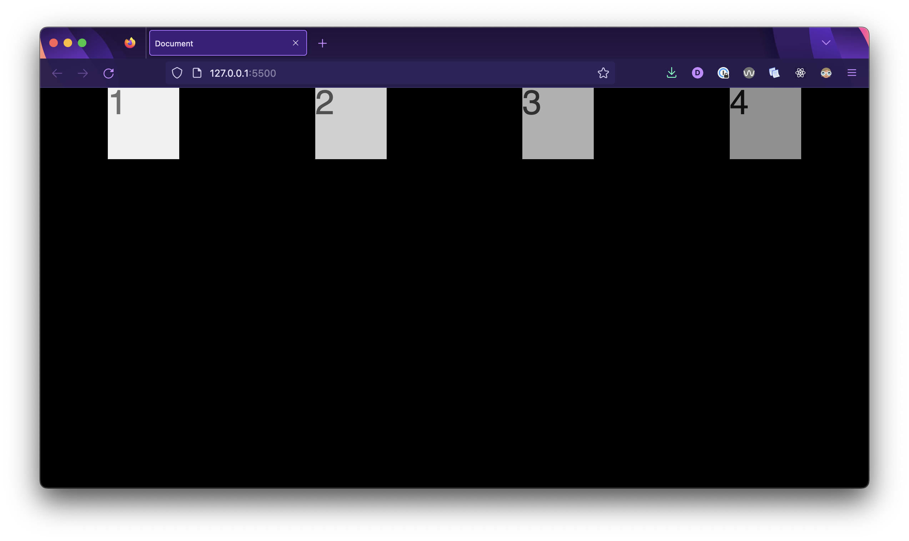
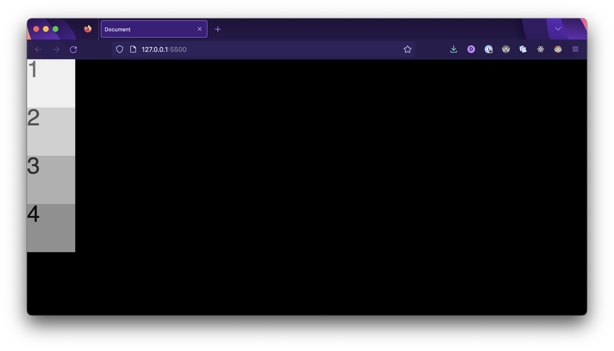
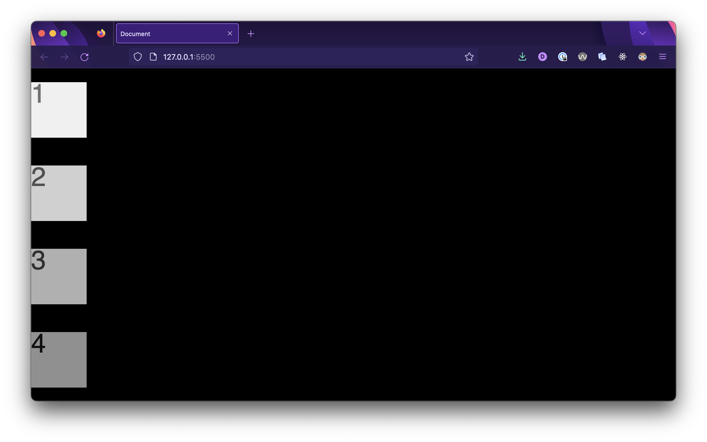

# Flexbox Properties


**Learning objective:** By the end of this lesson, students will be able to tktk

## Properties Basics: `justify-content`

Something to note with Flexbox is that the *vast* majority of the properties you write will be on the parent element, not the children. 

Let’s do a little experimentation based on what we’ve learned and coded so far. We’re going to change the code in the `flex-parent` class to:

```css
.flex-parent {
  background-color: black;
  display: flex;
  height: 600px;
}
```

and the code in the flex-child class to:

```css
.flex-child {
  font-family: sans-serif;
  font-size: 48px;
  height: 100px;
  width: 100px;
}
```

Small changes so far, but note that we have a bit of a sandbox to play in now. Let’s apply one of the most common alignment properties - `justify-content` - to the `flex-parent` class:

```css
.flex-parent {
  background-color: black;
  display: flex;
  height: 600px;
  justify-content: space-around;
}
```



Looking pretty good so far; let’s check out our dev tools and explore some more.

## You Do 💪

Center the `div`s inside of the `section` both horizontally and vertically.

This is an incredibly common action - remember how to do this; it’s a great note to have handy. (Seriously, you will probably use this dozens of times in **every project** you work on moving forward— not just at GA.)

## Property Basics: `flex-direction`

We’ve talked about how, as a default, a flexbox parent will lay out its children in a row, but we have another common way to lay out children as well - a column. Set your `.flex-parent` rule to this:

```css
.flex-parent {
  background-color: black;
  display: flex;
  height: 600px;
  flex-direction: column;
}
```

And here’s the result! Now the elements are laid out in a column!



Apply one more change to the `.flex-parent` rule: `justify-content: space-around;`



Notice the result and how it differs from when the `flex-direction` was its default value, `row`.

## Main Axis & Cross Axis

A **flex container** also has a **main axis** as well as a **cross axis**. 

For example, if the `flex-direction` is `row` (the default):

- The **main axis** is **horizontal** and is controlled by modifying the **justify-content** property.
- The **cross axis** is **vertical** and is controlled by modifying the **align-items** property.

If the `flex-direction` is `column`, they flip:

- The **main axis** is **vertical** and is controlled by modifying the **justify-content** property.
- The **cross axis** is **horizontal** and is controlled by modifying the **align-items** property.

🧠 This is something you shouldn’t try to memorize right away, and you probably won’t unless you use Flexbox repeatedly and often. So instead of trying to remember, just experiment whenever you build a layout - do this often enough, and you’ll remember it someday!

## A Complete Guide to Flexbox

With this knowledge in hand, you can now briefly review and, in the future, reference what has become the [de facto guide to Flexbox](https://css-tricks.com/snippets/css/a-guide-to-flexbox/) to explore what all we can do with this Flexbox.

