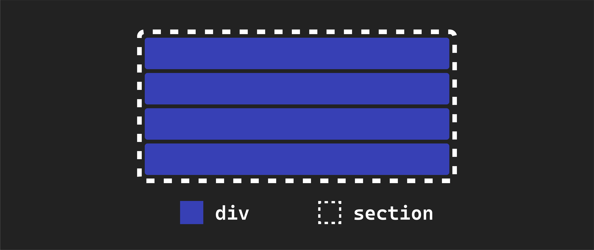
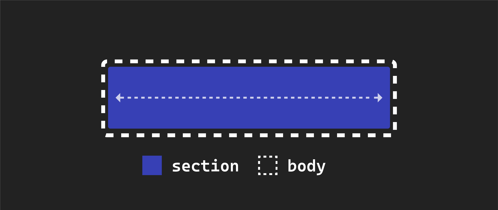
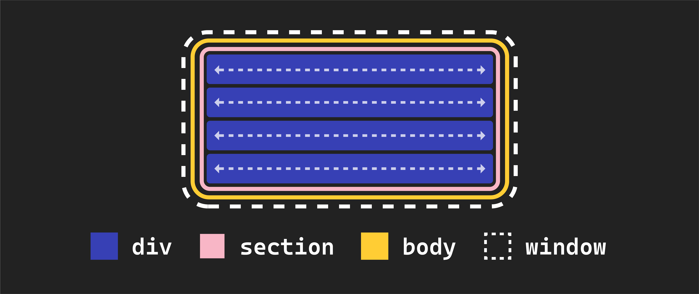
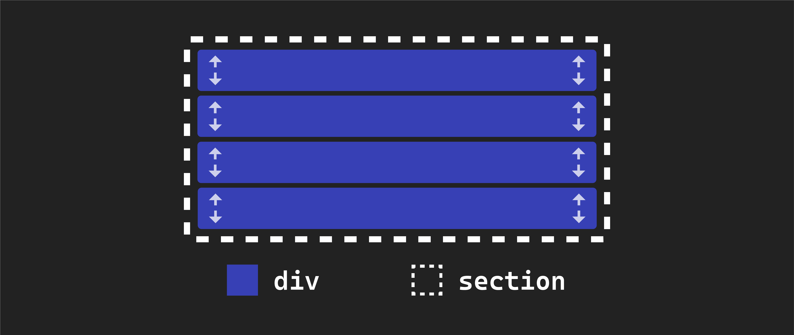
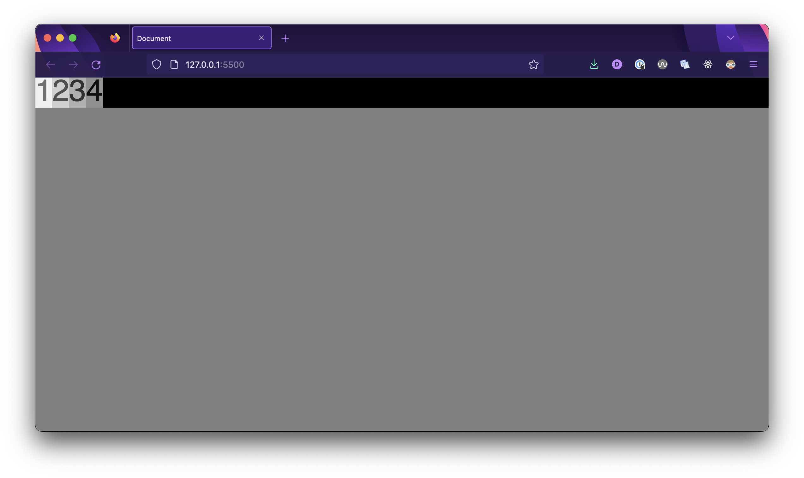

<h1>
  <span class="headline">Flexbox</span>
  <span class="subhead">Fundamentals</span>
</h1>

**Learning objective:** By the end of this lesson, students will be able to implement flexbox containers and observe the impact on the layout and behavior of child elements.

## Establishing default behavior

Let's explore some fundamental facts about the HTML structure we're dealing with. Building a solid understanding of how our elements behave by default will make it easier to see the changes when we start using flexbox.

```html
  <section class="flex-parent">
    <div class="flex-child" id="one">1</div>
    <div class="flex-child" id="two">2</div>
    <div class="flex-child" id="three">3</div>
    <div class="flex-child" id="four">4</div>
  </section>
```

The `<section>` element acts as a parent container for all four `<div>` elements within it. These `<div>` elements are considered the children of the `<section>` element, as indicated by our class names. It's important to note we don't see the `<section>` element's background color anywhere on our page - it is currently hidden behind the backgrounds of its child elements.



The `<section>` element is a **block** element. Block elements automatically expand to occupy the entire width of their parent element, which, in this case, is the `body` element. Since the `body` element, by default, spans the full width of the browser window, our `<section>` element also covers the entire width of the browser window.



Each `<div>` element inside the `<section>` is also a **block** element by default. Therefore, they also occupy the entire width of their **parent** element, which in this case, is the `<section>`. This explains why each `<div>` element spans the full width of the browser window.



By default, the **height** of these elements is determined by the content they contain. Unless you specify otherwise, they will be just as tall as they need to be to accommodate the content within them.


The same height behavior applies to the `<section>` element. Its **height** is entirely based on the combined height of its children elements. This is why the background color of the `<section>` element isn't visible on the page—it matches the total height of its child elements.



If you were to remove the text content from one of the `<div>` elements, it might seem as if the element has disappeared from the page, but it hasn't! Its height has just been reduced to 0

In our code, we have assigned classes `flex-parent` and `flex-child` to these items. However, the actual implementation of flexbox will take place in our CSS file. The class names themselves do not provide any functionality; they are for organizational purposes.

## Implementing flexbox

Now, let's explore how to enable flexbox on our page. We've discussed the default behavior of our elements before applying flexbox, but now we'll introduce the changes.

To implement flexbox, you'll need to modify the existing `.flex-parent` rule in your CSS like this:

```css
.flex-parent {
  background-color: black;
  display: flex;
}
```

We achieve this by adding a CSS property, `display`, set to the value `flex`. This declaration transforms an element into a *flex container* or *parent*.

> 🧠 It's essential to note that the specific class name, `flex-parent`, is not crucial to enable flexbox functionality. We're using it here to clarify the establishment of the parent-child relationship. In practice, you'd typically use more descriptive class names like `container` for better clarity.

After this change, your browser should look like this:



Let's review what has changed:

- The `<section>` element has transformed into a **flex parent** or **flex container.**

- When we applied flexbox to it, all the child `<div>` elements switched from being **block** elements to **inline-block** elements. Their height remains the same, but their width now matches the width of their content.

- As a result, the `<div>` elements no longer stretch to the full width of the `<section>`. You can now see the black background of the `<section>` element. Additionally, notice that the height of the `<section>` element has adjusted to match the combined height of its child elements.

- The `<div>` elements nested inside our flex-parent `<section>` (these are its children) have become **flex children** or **flex items**. They are automatically arranged in a row within their parent. This horizontal arrangement is the default behavior of a flexbox.
