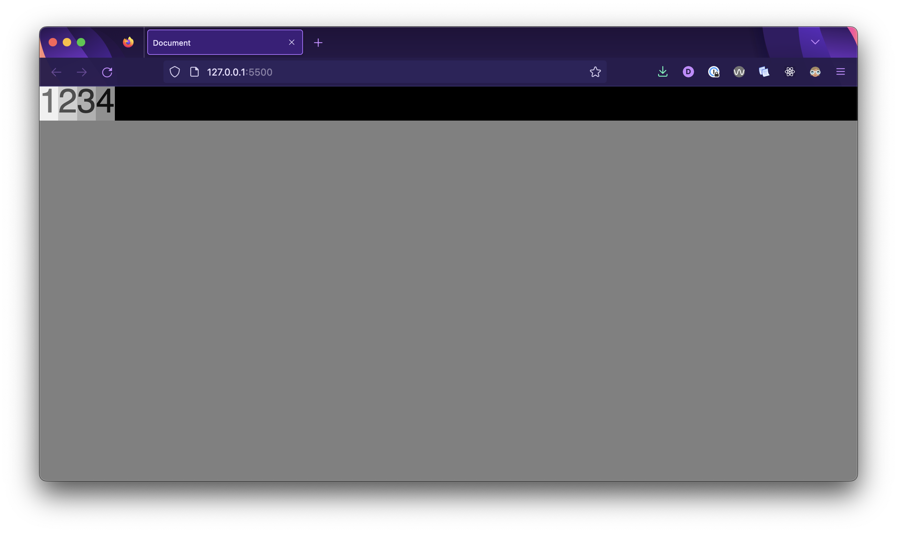

# Fundamentals


**Learning objective:** By the end of this lesson, students will be able to create Flexbox containers and items.

## Use of Classes to Define Flexbox Parents and Children

We are going to start with the simple HTML we created in Setup to get acquainted with the fundamentals of Flexbox:

```html
<section class="flex-parent">
  <div class="flex-child">1</div>
  <div class="flex-child">2</div>
  <div class="flex-child">3</div>
  <div class="flex-child">4</div>
</section>
```

Here, we are giving these items classes called `“flex-parent”` and `“flex-child”`, but the **actual application of Flexbox occurs in our CSS file.** Please note, we could give these items a totally unrelated class name, but let's be sure we are utilizing good developer practices by assigning meaningful naming conventions.

You should already have the rendering of the above HTML open in your browser and see something like this:


There are a few things of interest to take note of here so far:

- The `section` element is a **parent** element to the 4 `div` elements inside it. These `div` elements are the **children** of the `section` element (hence, our naming convention of the classes).
- The `section` element is a **block** element. Block elements take up the entire width of their parent element, which, in this case, is the `body` element. By default, the `body` element is the full width of the browser window. Therefore, our `section` will span the full width of the browser window as well.
- Because each `div` within the `section` are also **block** elements, they, by default, also take up the full width of their **parent** element. That is why each `div` spans the full width of the browser window.
- Also by default, their **height** is defined by the height of their contents. Unless you specify otherwise, they will be just as tall as they need to be to accommodate the content they hold.
- The same is true of the `section` element! Its height is based entirely on the height of its children. Note we don’t see its background color anywhere on our page - it’s currently obscured by the background color set on the children elements!
- If you remove the text from one of the `divs`, it looks like the element has been removed from the page, but **it hasn’t!** **Its height has just been reduced to 0.**
- Note the `:nth-child(X)` pseudo-class in our CSS file. This selector matches with an element based on its position in its parent. This means if there are 6 `div` children and we only want to write style rules for the 3rd, we would write `div:nth-child(3)`

## Enable Flexbox Containers and Items Utilizing CSS Rules

The above is all the behavior of our page in its default state before making any of the elements into a Flexbox. Let’s change that now:

Change the existing `.flex-parent` rule in your CSS to this:

```css
.flex-parent {
  background-color: black;
  display: flex;
}
```

We use a CSS `display: flex;` declaration to make an element a *flex container* or **parent**.

🧠 The `flex-parent` class name isn’t important to making this a Flexbox! We’re just using it here to clarify where the parent/child relationship is being formed. You typically wouldn’t have a class with this name - something like `container` is far more common.

After this change, your browser should look like this:



Note the changes!

- When we made this into a Flexbox, all of the children of the Flexbox (the `div` elements) became **inline-block** elements instead of **block** elements. Their height is unchanged, but their width has collapsed to the width of the content inside of them.
- Because the `div` elements’ widths have collapsed, they no longer take up the full width of the `section`, and we can see the black background of said `section` element. Also, note how the height of the `section` element has collapsed so that it is still the height of its children elements.
- The `section` element is now a **flex parent** or **flex container.**
- The `div` elements nested inside of our flex-parent `section` (aka, its children) are now **flex children** or **flex items** and are arranged in a row inside their parent. Arranging the children in a row is the default behavior of a Flexbox.