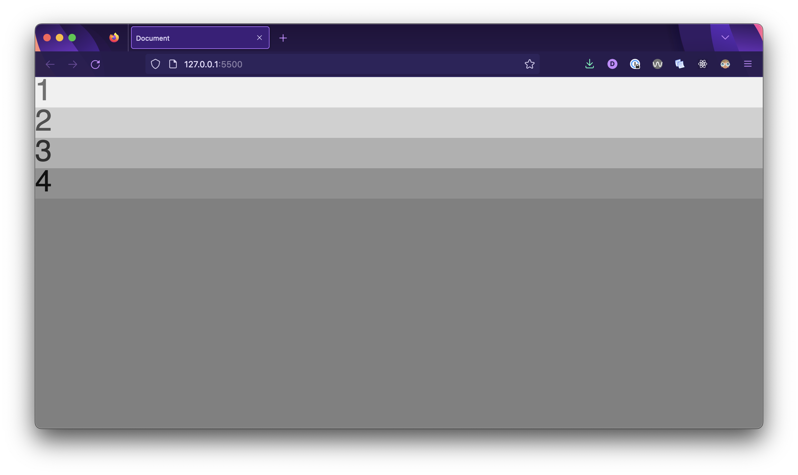

# 

**Learning objective:** By the end of this lesson, students will be able to create HTML and CSS files with starter code for this module's lecture.

Open your Terminal application and navigate to your `~/code/ga/lectures` directory:

```bash
cd ~/code/ga/lectures
```

Make a new directory called `flexbox`, then enter this directory:

```bash
mkdir flexbox
cd flexbox
```

Create a folder called `css`:

```bash
mkdir css
```

Then, create an `index.html` file and a `style.css` file that lives inside the `css` folder. These files will hold your work for this lecture:

```bash
touch index.html ./css/style.css
```

With the files created, open the contents of the directory in VS Code:

```bash
code .
```

Open the `index.html` file and add HTML boilerplate by typing `!` and then hitting the `Tab` key. Then link the `style.css` file by adding this line inside the `<head>` tag:

```html
<link rel="stylesheet" href="./css/style.css">
```

Add the following HTML inside the body:

```html
  <section class="flex-parent">
    <div class="flex-child" id="one">1</div>
    <div class="flex-child" id="two">2</div>
    <div class="flex-child" id="three">3</div>
    <div class="flex-child" id="four">4</div>
  </section>
```

Add the following to `css/style.css`:

```css
body {
  background-color: gray;
  font-family: sans-serif;
  margin: 0;
}

.flex-parent {
  background-color: black;
}

.flex-child {
  font-size: 48px;
}

#one {
  background-color: #f0f0f0;
  color: #707070;
}

#two {
  background-color: #d0d0d0;
  color: #505050;
}

#three {
  background-color: #b0b0b0;
  color: #303030;
}

#four {
  background-color: #909090;
  color: #101010;
}
```

Open the `index.html` file in your browser.

You should see something that looks like the following in your browser:


